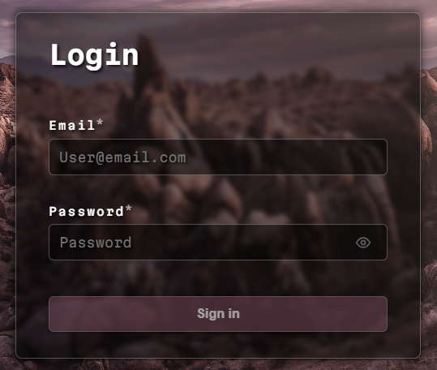

# Martians Login Form 👽🚀

Welcome to the cosmic gateway of user authentication — **Martians Login Form**!  
This sleek and futuristic login interface is designed with an interstellar aesthetic, inspired by the advanced technology of the Martian colonies. Enter your credentials and beam yourself into the next frontier of web apps.

---

## 🌌 Live Demo
Experience the Martian vibe firsthand:  
[https://vitali007tut.github.io/martians-login-form/](https://vitali007tut.github.io/martians-login-form/)

---

## 🛠 Technologies & Tools

This project is built with a blend of modern web technologies and tools, powered by the latest cosmic tech stack:

- **React 19** — For building a smooth, reactive user interface
- **TypeScript** — Bringing cosmic-level type safety to the codebase
- **Vite** — Lightning fast build and development tool from the future
- **ESLint & TypeScript-ESLint** — To keep the code flawless and Martian-grade clean
- **gh-pages** — For teleporting the build to the web via GitHub Pages
- **clsx** — For flexible and stylish condition-based class name management

---

## 🚀 How to Run

Clone the repository and initiate warp speed development with the following commands:

```bash
git clone https://github.com/vitali007tut/martians-login-form.git
cd martians-login-form
npm install
npm run dev
```
---

## 🧑‍🚀 Project Overview

The Martians Login Form is a minimalistic yet futuristic login form with two main fields:  
- **Email**  
- **Password**  

Whether you're a native Martian or an Earthling traveler, this form prepares you to log in securely with style.

---

## 👾 Preview




---

Blast off and enjoy your journey through this Martian user experience! 🌠
